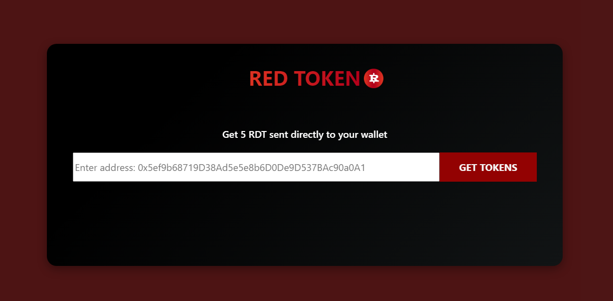

# RedToken Faucet (RDT)

RedToken faucet is an application that provides small amounts of tokens to users, typically for free. Users can claim these tokens every 24hrs per address.



## Links

**DApp:** https://dapp-faucet.vercel.app/

**Faucet Contract:** [0x77D87808835e6bE686289323c25ABa90039CFC4d](https://sepolia.etherscan.io/address/0x77D87808835e6bE686289323c25ABa90039CFC4d)

**Token Contract:** [0x965f9a05A5bec56403ADeE52d5608194dB0D9d01](https://sepolia.etherscan.io/address/0x965f9a05A5bec56403ADeE52d5608194dB0D9d01)

## Get tokens

- Open Metamask and import the token address below

  RDT address

        0x77D87808835e6bE686289323c25ABa90039CFC4d

- Enter the wallet address in the address box and click `Get Tokens` button
- Check your wallet after transaction completed

# Getting Started

## Requirements

- [git](https://git-scm.com/book/en/v2/Getting-Started-Installing-Git)
  - You'll know you did it right if you can run `git --version` and you see a response like `git version x.x.x`
- [Nodejs](https://nodejs.org/en/)
  - You'll know you've installed nodejs right if you can run:
    - `node --version` and get an output like: `vx.x.x`
    - It'll need to be at least `18.16.0` of node

## Quickstart

```
git clone https://github.com/sanjay-in/dapp-faucet
cd dapp-faucet
npm install
```

Start hardhat node

```
npx hardhat node
```

Start client server

```
npm run dev
```

# Usage

Deploy:

```
npm hardhat deploy
```

## Testing

```
npm hardhat test
```

### Test Coverage

```
npm hardhat coverage
```

## Deployment to a testnet or mainnet

1.  Setup environment variables

    You'll want to set your `SEPOLIA_RPC_URL`, `ETHERSCAN_API_KEY` and `PRIVATE_KEY` as environment variables. You can add them to a `.env` file.

    - `PRIVATE_KEY`: The private key of your account (like from [metamask](https://metamask.io/)). **NOTE:** FOR DEVELOPMENT, PLEASE USE A KEY THAT DOESN'T HAVE ANY REAL FUNDS ASSOCIATED WITH IT.
    - You can [learn how to export it here](https://metamask.zendesk.com/hc/en-us/articles/360015289632-How-to-Export-an-Account-Private-Key).
    - `SEPOLIA_RPC_URL`: This is url of the sepolia testnet node you're working with. You can get setup with one for free from [Alchemy](https://alchemy.com/?a=673c802981)
    - `ETHERSCAN_API_KEY`: If you deploy to a testnet or mainnet, you can verify it if you get an API Key from Etherscan and set it as an environment variable.

2.  Get testnet ETH

    Here are few faucets where you can get free Sepolia ETH

    - https://www.alchemy.com/faucets/ethereum-sepolia
    - https://faucets.chain.link/sepolia
    - https://cloud.google.com/application/web3/faucet/ethereum/sepolia

3.  Deploy

    ```
    npm hardhat deploy --network sepolia
    ```

4.  Verify on etherscan

    If you deploy to a testnet or mainnet, you can verify it if you get an [API Key](https://etherscan.io/myapikey) from Etherscan and set it as an environment variable named `ETHERSCAN_API_KEY`.

    In its current state, if you have your api key set, it will auto verify sepolia contracts!

    However, you can manual verify with:

    ```
    npm hardhat verify --constructor-args arguments.js DEPLOYED_CONTRACT_ADDRESS
    ```
